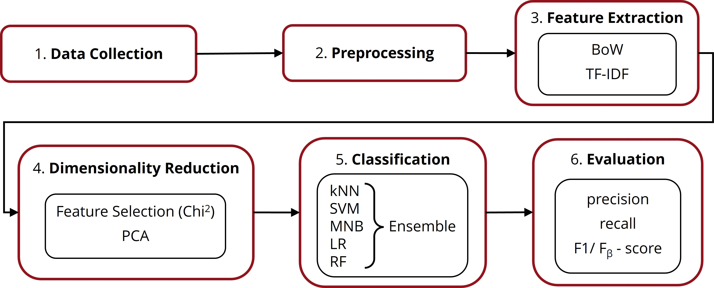

# Requirements Classification Pipeline for Requirements Reuse
In various domains, such as aero-space or automotive, standards are applied to reuse requirements and ensure a high level of product quality and safety. During **standard tailoring**, requirements from the applicable standards are specialized and integrated into the project. However, the requirement type influences the way the standard requirement interacts with project requirements. There are five different types: *functional* (F), *non-functional* (NF), *project management* (PM), *meta* (M), and *view* (V) requirements. To support the process of standard tailoring, the requirements from the applicable standards should be classified before integration. Yet, manual classification of large existing standards is time-consuming. This artifact presents a **classification pipeline** to compare **five machine learning algorithms** for this task: *k-Nearest Neighbor* (kNN), *Support Vector Machine* (SVM), *Logistic Regression* (LR), *Multinomial Naive Bayes* (MNB), *Random Forest* (RF), as well as an *ensemble model* that combines all five. A set of classified requirements serves as input and, after various preparation steps, is used to train and test the models generated by the different algorithms. The evaluation results, showing how well the algorithms perform, are the output of the pipeline.

Furthermore, we propose an approach to extend the classification by the context of terms contained in a requirement to potentially improve the performance. The contextualization is based on the hierarchy levels of the ECSS and is integrated into the *Preprocessing* phase of the pipeline.

The six phases of the classification pipeline:



## Description of Artifact
The models were originally trained and tested with 466 requirements from the European Cooperation for Space Standardization [(ECSS)](https://ecss.nl/). However, due to the intellectual property rights of the ECSS (https://ecss.nl/license-agreement-disclaimer/), the full dataset cannot be republished (request for permission pending). Thus, we provide the [PROMISE_exp](https://tinyurl.com/PROMISE-exp) requirements set as a placeholder input dataset so that the processing steps of the pipeline can be understood despite the missing set of standard requirements set. Note, however, that we have artificially extended the PROMISE_exp dataset to demonstrate our approach of context integration. In the extended version, ECSS standard IDs serve as a dummy requirements source references. However, there is no real connection between the ECSS standards and the PROMISE_exp requirements.

The artifact is structured as follows:

### Evaluation Results for ECSS Data
The directory "evaluation_results_for_ECSS_data" contains the evaluation results obtained from the original ECSS data. This includes the evaluation results of the classical pipeline (subdirectory "without_context_integration") as well as the results of the extended pipeline (subdirectory "with_context_integration"). Both subdirectories contain a table with the precision, recall, and F1 score of the algorithms ("evaluation_metrics.xlsx"), tables with the standard deviations measured during cross-validation ("evaluation_precision_standard_deviation.xlsx", "evaluation_recall_standard_deviation.xlsx", "evaluation_f1_standard_deviation.xlsx"), a table showing the three metrics per label for each algorithm ("evaluation_labels.xlsx"), a column chart visualizing the achieved F1 scores ("evaluation_f1_column_chart.xlsx"), the mean times for training and testing the models ("evaluation_time.xlsx"), and an analysis of variance (ANOVA) to prove the (in-)significance of performance differences ("evaluation_analysis.xlsx").

### Resources
The directory "resources" initially contained the requirements data basis "EARM_ECSS_export(DOORS-v0.9_v2_21Feb2023).xlsx" retrieved from the [ECSS DOORS database v.0.9](https://ecss.nl/standards/downloads/earm/). This file is empty due to IP rights of ECSS, but should indicate our original procedure. "ECSS_standards_classified.csv" can be used for reproduction (see [Steps to Reproduce](#steps-to-reproduce)).

The subdirectory "ECSS_term_contexts" contains all data relevant for the integration of term contexts. "ECSS-Abbreviated-Terms_active-and-superseded-Standards-(from-ECSS-DOORS-database-v0.9_5Oct2022).xlsx" and "ECSS-Definitions_active-and-superseded-Standards-(from-ECSS-DOORS-database-v0.9_5Oct2022).xlsx" are again empty files originally retrieved from the [ECSS DOORS database v.0.9](https://ecss.nl/glossary/glossary-definitions-abbreviated-terms/). They indicate where the information on ECSS terms and abbreviations initially comes from and are used by ``lookup_tables_builder.py`` to create the lookup tables "lookup_terms.csv" and "lookup_abbreviations.csv". They assign full terms and abbreviations of the ECSS to the standards and branches in which they are defined.

### Data Collection
The directory "0_data_collection" corresponds to the first phase of the pipeline, where the dataset for training and testing is built. ``data_collection.py`` collects all classified requirements from "EARM_ECSS_export(DOORS-v0.9_v2_21Feb2023).xlsx" and stores the prepared requirements set in the "output" subdirectory, which, in this case, contains the extended PROMISE_exp dataset.

### Preprocessing
The directory "1_preprocessing" corresponds to the second phase. By running ``preprocessing.py`` the collected requirements can be cleaned and normalized. The resulting requirements set is stored in "output".

Additionally, the optional integration of term contexts can be carried out in this phase by running ``context_integration.py``. The mere requirement texts are complemented by pairs of terms and the associated contexts. The extended data is also stored in "output" to be passed on to the next phase.

### Feature Extraction
The directory "2_feature_extraction" corresponds to the third phase, where the (extended) requirement texts are transformed into feature vectors using *Bag of Words* (BoW) and *Term Frequency - Inverse Document Frequency* (TF-IDF). Running ``feature_extraction.py`` will vectorize the preprocessed requirements (with and without context extension) and store them in "output".

### Dimensionality Reduction
The directory "3_dimensionality_reduction" corresponds to the fourth phase, where the dimensionality of the feature vectors created in the previous phase is reduced by using *Feature Selection with Chi <sup>2</sup>* (``feature_selection.py``) and *Principal Component Analysis* (PCA) (``principal_component_analysis.py``). Both techniques can be applied by running the corresponding .py files. Note that ``feature_selection.py`` takes the data from the previous phase as input while ``principal_component_analysis.py`` further reduces the data generated by feature selection. To compare both variants (feature selection only and feature selection with PCA), there are four subdirectories in 'output' that contain the respective preparation variants for each algorithm.

Furthermore, the subdirectory "hyperparameter_tuning" contains ``hyperparameter_tuning.py``, which can be run and adjusted if necessary to find the best hyperparameter settings for the different algorithms. The settings determined for the original ECSS data can be found in "hyperparameter_tuning_results.txt".

### Classification & Evaluation
The directory "4_classification&evaluation" corresponds to the last two phases of the pipeline, where the models are created and evaluated by the metrics *precision*, *recall* and *F1 score*. The metrics are calculated by cross-validation to ensure reliable results. To obtain the evaluation results for the requirements data not extended by term contexts, one can run ``classification.py`` and for the data extended by term contexts ``classification_context.py``. All evaluation results are then stored in "output", which is again divided into two subdirectories for the data with and without context integration. The evaluation results include the metrics for all algorithms and variants of data preparation and more (see [Evaluation Results for ECSS Data](#evaluation-results-for-ecss-data)). They make it possible to compare the machine learning models.

To assess the significance of performance differences (especially interesting for our approach of term context integration), one can add the tables "evaluation_analysis.xls" and "context_evaluation_analysis.xlsx" to the subdirectories "without_context_integration" and "with_context_integration". They contain an analysis based on the values in the generated tables of the respective subdirectory. Currently, they are customized for the original ECSS dataset and will need to be adjusted in terms of labels if they are to be used for other requirement sets. However, in case of reproduction, nothing needs to be changed.

Further, both analysis tables can compute the *F<sub>β</sub> score* in addition to the three metrics mentioned above. Note, however, that again certain parts of the tables will need to be adjusted for requirements with different labels.

## System Requirements
To run the classification pipeline, your system must meet the following requirements:

- Python 3.11.9
- Pip 23.3.2
- IDE suitable for Python (e.g. Visual Studio Code) 
- For .xlsx data files: spreadsheet editor like Microsoft Excel 2016 or newer
- For .csv files: text or spreadsheet editor

## Installation Instructions
To run the artifact, follow these steps:

### 1) Clone the repository into your IDE. 
```
git clone https://gitlab.uni-koblenz.de/maerdian01/anforderungsklassifizierung.git (needs to be replaced!)
```
### 2) Create a virtual environment for the project:
```
python -m venv .venv
```
### 3) Activate the virtual environment:
```
.venv\Scripts\activate
```
### 4) Install the required libraries:
```
pip install -r requirements.txt
```
Now, you are able to run all Python files in this repository.

## Usage Instructions
The pipeline is essentially realized by the five directories: 

- 0_data_collection
- 1_preprocessing
- 2_feature_extraction
- 3_dimensionality_reduction
- 4_classification&evaluation

A requirements input set collected during *data collection* and stored in the "output" subdirectory of this phase (in our placeholder example 'PROMISE_dummy_Standards.csv') can be passed through the classification pipeline step by step. That is, if you have reproduced the original ECSS input data, or you want to feed the pipeline with a different requirements set, you need to place it in "0_data_collection\output" and update the filename referenced in ``preprocessing.py``. You can then manually run the corresponding .py files of the listed directories as detailedly explained in [Description of Artifact](#description-of-artifact). This way you can retrace the processing steps of the different phases and see what the data passed from phase to phase looks like in the respective "output" subdirectories. Finally, the output of the pipeline, namely the evaluation results, will be visible in "4_classification&evaluation\output". Note, however, that ``classification_context.py`` and ``classification.py`` in "4_classification&evaluation" will need to be adjusted if the input requirements have labels other than the five used in our paper, and the hyperparameter settings in "3_dimensionality_reduction" should also be adjusted for optimal results.

Another possible use case for the pipeline could be the classification of new and yet unclassified ECSS requirements. To do this, the "4_classification&evaluation" directory would have to be split so that the two phases could operate separately and predictions about unknown requirements could be made before evaluation.

## Steps to Reproduce
As mentioned above, the original ECSS input dataset cannot be republished, but we can provide instructions on how to reproduce it. "ECSS_standards_classified.csv" in the "resource" directory provides a list of the requirement IDs, their source standards and our manually assigned classes. After regisration at https://ecss.nl/register/, one can access the respective standards and reproduce the original dataset.
If one then runs the pipeline with the ECSS dataset, they can obtain the results presented in the paper, except for the values generated by RF. They can differ even with the same input due to the random factor within RF.

## Authors Information
University of Koblenz, Institute for Software Technology (IST):
- Julia Märdian 
- Katharina Großer 
- Jan Jürjens 

## Artifact Location


## License
Software under MIT License

Copyright (c) 2022-2023 Julia Märdian, Katharina Großer, Jan Jürjens

Permission is hereby granted, free of charge, to any person obtaining a copy of this software and associated documentation files (the "Software"), to deal in the Software without restriction, including without limitation the rights to use, copy, modify, merge, publish, distribute, sublicense, and/or sell copies of the Software, and to permit persons to whom the Software is furnished to do so, subject to the following conditions:

The above copyright notice and this permission notice shall be included in all copies or substantial portions of the Software.

THE SOFTWARE IS PROVIDED "AS IS", WITHOUT WARRANTY OF ANY KIND, EXPRESS OR IMPLIED, INCLUDING BUT NOT LIMITED TO THE WARRANTIES OF MERCHANTABILITY, FITNESS FOR A PARTICULAR PURPOSE AND NONINFRINGEMENT. IN NO EVENT SHALL THE AUTHORS OR COPYRIGHT HOLDERS BE LIABLE FOR ANY CLAIM, DAMAGES OR OTHER LIABILITY, WHETHER IN AN ACTION OF CONTRACT, TORT OR OTHERWISE, ARISING FROM, OUT OF OR IN CONNECTION WITH THE SOFTWARE OR THE USE OR OTHER DEALINGS IN THE SOFTWARE.

All non-software data files within the project are published under the CC-BY 4.0 license (https://creativecommons.org/licenses/by/4.0/)

License for adjusted PROMISE_exp requirements set (0_data_collection\output\PROMISE_dummy_Standards.csv):

(c) 2007  Jane Cleland-Huang  jhuang@cti.depaul.edu
This data set is distributed under the
Creative Commons Attribution-Share Alike 3.0 License
http://creativecommons.org/licenses/by-sa/3.0/